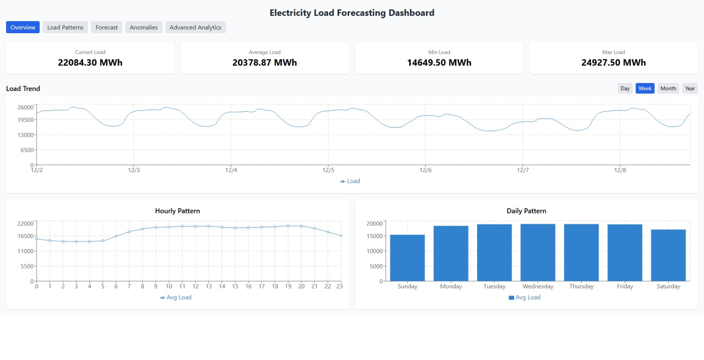
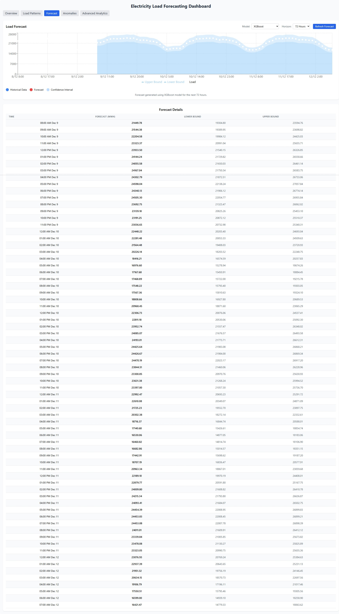
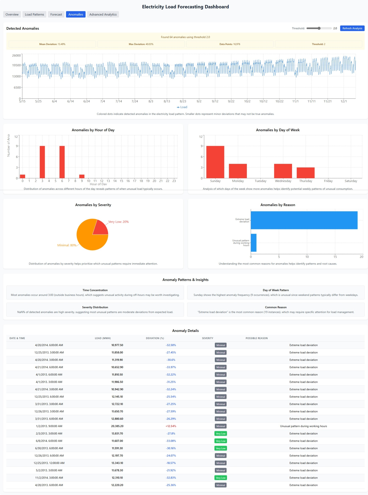

# Electricity Dashboard Frontend

This document provides an overview of the interactive electricity load dashboard application, featuring real-time visualization, forecasting, and anomaly detection capabilities.

## Dashboard Features

The dashboard provides a comprehensive interface for analyzing electricity load data, making forecasts, and detecting anomalies. It is divided into five main sections:

1. **Overview** - Key statistics and historical data visualization
2. **Load Patterns** - Analysis of temporal patterns in electricity consumption
3. **Forecast** - Real-time forecasting with multiple models and horizons
4. **Anomalies** - Detection and analysis of unusual consumption patterns
5. **Advanced Analytics** - Deeper insights into load patterns and relationships

## Overview Screen

The Overview screen provides a high-level summary of electricity consumption data with key statistics and historical trends. It displays current load, average load, minimum load, and maximum load for the selected time period. The main chart shows load values over time with the ability to select different time ranges (day, week, month, year).

## Load Patterns Screen

The Load Patterns screen allows users to analyze temporal patterns in electricity consumption across different time dimensions. It includes visualizations for:

- Hourly patterns (average load by hour of day)
- Daily patterns (average load by day of week)
- Monthly patterns (average load by month of year)

These visualizations help identify recurring patterns and seasonal effects in electricity consumption.

## Forecast Screen

The Forecast screen enables users to generate and visualize electricity load forecasts for future periods. Key features include:

- Model selection (Gradient Boosting, XGBoost, Random Forest, Linear Regression, SVR)
- Forecast horizon selection (12, 24, 48, or 72 hours)
- Visualization of historical data and forecasts on a single chart
- Confidence intervals around forecasts
- Color-coded representation of actual vs. forecasted values

The forecasts are generated in real-time using the selected machine learning model and are based on historical patterns and features.

## Anomalies Screen

The Anomalies screen helps users identify and analyze unusual patterns in electricity consumption. Features include:

- Automated anomaly detection using statistical methods
- Adjustable detection sensitivity via threshold controls
- Visualization of detected anomalies on the load chart
- Detailed anomaly information including severity, deviation percentage, and possible reasons
- Summary statistics about detected anomalies

This screen is valuable for identifying potential issues, unusual consumption patterns, or data quality problems.

## Advanced Analytics Screen

The Advanced Analytics screen provides deeper insights into electricity consumption patterns and their relationships with various factors. It includes:

- Correlation analysis between load and weather variables
- Feature importance visualization for the forecasting models
- Load distribution analysis across different time dimensions
- Interactive charts for exploring relationships between variables
- Statistical summaries and trend analysis

This screen is designed for data analysts and energy experts who need more detailed insights into the factors affecting electricity consumption.

## Technical Implementation

The frontend is built using:

- **React**: For component-based UI development
- **Recharts**: For responsive, interactive data visualizations
- **TailwindCSS**: For styling and responsive design
- **Lodash**: For data manipulation and transformation

The frontend communicates with a Flask API backend to retrieve historical data, generate forecasts, and detect anomalies. All visualizations are interactive, allowing users to hover for detailed information, zoom in on specific time periods, and filter data as needed.

## Usage Tips

- Use the time range selector to focus on different periods (day, week, month, year)
- Experiment with different forecasting models to compare their performance
- Adjust the anomaly detection threshold based on your sensitivity requirements
- Hover over charts to see detailed information for specific data points
- Use the Advanced Analytics screen to understand the factors influencing electricity consumption 