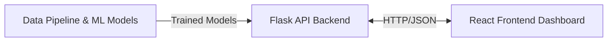
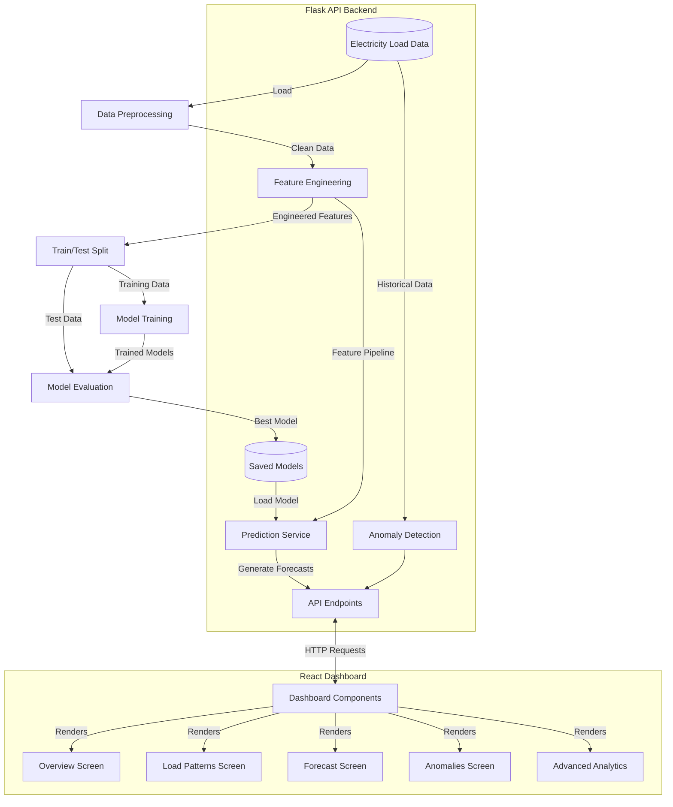

# Energy Consumption Forecasting System

A comprehensive electricity load forecasting system with advanced machine learning models, anomaly detection, and an interactive dashboard for visualization and analysis.


## Project Overview

This project implements an end-to-end solution for electricity load forecasting and analysis, consisting of:

1. A Python-based forecasting pipeline with multiple ML models
2. A Flask API backend for real-time inference
3. A React-based interactive dashboard for visualization and analysis

The system enables energy providers to predict future electricity demand with high accuracy, identify anomalous consumption patterns, and analyze historical patterns to optimize energy production and distribution.

## Detailed Documentations

- [Detailed Analysis and Implementation Report](REPORT.md) - Comprehensive documentation of the forecasting pipeline, data analysis, models, and results
- [Frontend Documentation](FRONTEND.md) - Overview of the dashboard interface with screenshots and features

## System Architecture

The system follows a three-tier architecture:



### Key Components:

1. **Data Pipeline & ML Models**
   - Implemented in Python using scikit-learn and pandas
   - Handles data preprocessing, feature engineering, and model training
   - Supports multiple forecasting models (Gradient Boosting, XGBoost, Random Forest, etc.)
   - Includes anomaly detection algorithms

2. **Flask API Backend**
   - Serves model predictions and analysis via RESTful endpoints
   - Handles dynamic feature engineering and forecasting
   - Provides anomaly detection capabilities

3. **React Frontend Dashboard**
   - Interactive visualization of historical data and forecasts
   - Multiple views for different analytical perspectives
   - Real-time forecasting and anomaly detection

## Implementation Flow

The system operates through the following flow:

1. **Data Ingestion & Preprocessing**
   - Historical electricity load data is loaded
   - Data quality checks and preprocessing are performed
   - Temporal features and weather-related features are extracted

2. **Model Training & Evaluation**
   - Multiple forecasting models are trained on historical data
   - Models are evaluated using RMSE, MAE, MAPE, and R² metrics
   - The best-performing model is selected for production use

3. **Forecasting**
   - The system generates forecasts for future periods (12-72 hours)
   - Confidence intervals are calculated for uncertainty estimation
   - Recursive forecasting allows for multi-step predictions

4. **Anomaly Detection**
   - Statistical methods identify unusual consumption patterns
   - Anomalies are classified by severity and potential causes
   - Historical anomalies are analyzed for patterns

5. **Visualization & Analysis**
   - Interactive dashboard presents forecasts and historical data
   - Temporal patterns (hourly, daily, monthly) are visualized
   - Advanced analytics provide insights into consumption factors

## Detailed Data Flow

The following diagram illustrates the detailed data flow through the system:



## Project Structure

```
├── forecasting-pipeline.py   # Main ML pipeline implementation
├── models/                   # Saved ML models
├── electricity-dashboard/    # Frontend & Backend implementation
│   ├── src/                  # React frontend code
│   ├── api/                  # Flask API backend
│   │   └── app.py            # API endpoints implementation
├── frontend-screenshots/     # Screenshots of the dashboard
├── README.md                 # This file
├── REPORT.md                 # Detailed analysis and implementation report
└── FRONTEND.md               # Frontend documentation with screenshots
```

## Features

- **Multiple Forecasting Models**: Gradient Boosting, XGBoost, Random Forest, Linear Regression, SVR
- **Advanced Feature Engineering**: Temporal features, lagged values, rolling statistics
- **Interactive Visualization**: Historical data, forecasts, patterns, anomalies
- **Anomaly Detection**: Statistical methods to identify unusual consumption patterns
- **Temporal Pattern Analysis**: Hourly, daily, weekly, and seasonal patterns
- **Confidence Intervals**: Uncertainty estimation for forecasts
- **Adjustable Forecast Horizons**: 12, 24, 48, or 72 hours
- **Model Performance Metrics**: RMSE, MAE, MAPE, R²

## Quick Start

1. **Setup Environment**:
   ```bash
   pip install -r requirements.txt
   ```

2. **Run Flask API Backend**:
   ```bash
   cd electricity-dashboard/api
   python app.py
   ```

3. **Start React Frontend**:
   ```bash
   cd electricity-dashboard
   npm install
   npm start
   ```

4. Access the dashboard at `http://localhost:3000`


## Performance

The forecasting system achieves a Mean Absolute Percentage Error (MAPE) of under 5% for 24-hour ahead forecasts using the Gradient Boosting model. The ensemble models (Gradient Boosting, XGBoost, Random Forest) consistently outperform traditional regression approaches.

## Future Work

See the [full report](REPORT.md) for detailed discussion of potential future improvements, including:

- Deep learning models (LSTM, Transformers)
- External data integration
- Ensemble modeling
- Probabilistic forecasting
- Advanced anomaly classification